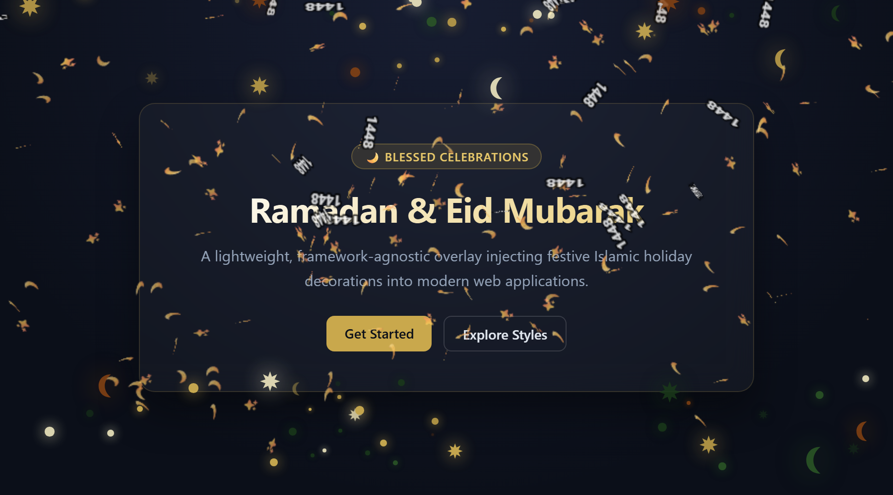
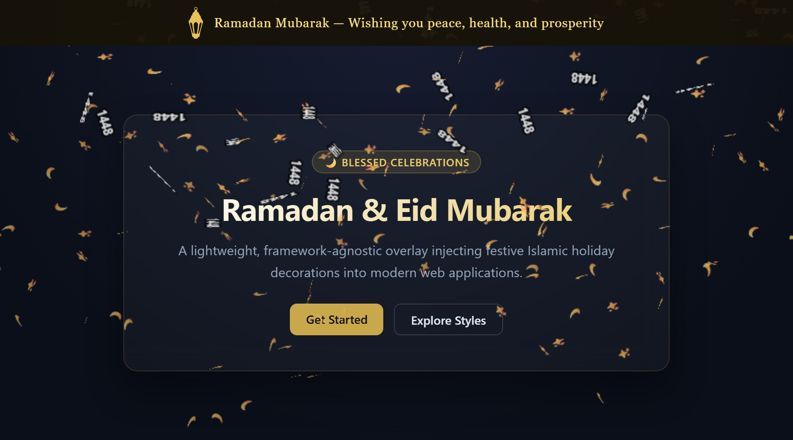

<div align="center">


# 🌙 ramadan-overlay

**Beautiful, auto-triggering Ramadan and Eid decorations for any website**

[](https://www.npmjs.com/package/ramadan-overlay)
[](https://www.npmjs.com/package/ramadan-overlay)
[](https://unpkg.com/ramadan-overlay/dist/ramadan-overlay.min.js)
[](https://opensource.org/licenses/MIT)

[](https://cdn.jsdelivr.net/npm/ramadan-overlay/dist/ramadan-overlay.min.js)
[](https://unpkg.com/ramadan-overlay/dist/ramadan-overlay.min.js)

A lightweight TypeScript library that injects beautiful Ramadan and Eid decorations into any web app —
**zero dependencies, no build step required.** Auto-detects Ramadan, Eid Al-Fitr, and Eid Al-Adha via the Hijri calendar
with support for 10+ regional presets.

[**🔴 Live Demo & Config Generator →**](https://3mr-5aled.github.io/ramadan-overlay/)

</div>

---

## ✨ Features

- 🗓️ **Auto-detection** — activates automatically during Ramadan, Eid Al-Fitr, and Eid Al-Adha using Hijri calendar conversion
- 🎨 **8 visual variants** — Lanterns, Sparkles, Crescent & Stars, Geometric, Eid Al-Fitr, Eid Al-Adha, Auto-Eid, and Contextual Banner
- 🏮 **Crisp Silhouette Lanterns & Stacking** — 12 authentic lantern designs rendered with pure silhouettes, independent `lanternZIndex` elevation control, and glowing pulse halos
- 🧵 **Curved Festoon Ropes** — Choose between straight rails, scallop swags (`u-shaped`), or dual catenary festival cables (`dual`) with adjustable sag depth
- 🎭 **7 Cultural Themes & Elevation Shadows** — Designer presets (Classic, Midnight, Emerald, Royal, Desert Dusk, Platinum Minimal, Rose Sahara) and 3 elevation depth levels (`none`, `soft`, `deep`)
- 🚀 **Ascending Motion & Intensity Engine** — Bottom-to-top ascending animation for crescents, stars, and Eid shapes with configurable intensity scale (1–10)
- ⏱️ **Iftar Countdown Widget & Melodic Chime** — Interactive countdown card with minimizable docked pill, Web Audio harmonic synthesizer chime, and gesture autoplay priming
- 🛡️ **Reading Safe-Zone Clearance** — Lateral gutter clearance (`edges`) to preserve central readability, or unconstrained full-viewport drift (`full`)
- 🕛 **Live midnight transitions** — dynamic transitions and automatic re-synchronization across midnight and tab focus changes
- 🌍 **Region-aware** — 10+ regional calendar presets with configurable day offsets
- ⚡ **Zero dependencies** — lightweight, tree-shakeable, and framework-agnostic
- 🧩 **All frameworks** — First-class wrappers for React, Vue 3, Angular, Svelte, or plain HTML / CDN
- 🎊 **Festive Confetti** — celebratory bursts for holiday milestones and Iftar T-0
- 🖌️ **Deeply customizable** — colors, opacity, density, position, custom mount targets, and callbacks

---

## 📦 Installation

```bash
npm install ramadan-overlay
# or
pnpm add ramadan-overlay
# or
yarn add ramadan-overlay
```

**CDN (no bundler needed):**

```html
<!-- jsDelivr (recommended) -->
<script src="https://cdn.jsdelivr.net/npm/ramadan-overlay/dist/ramadan-overlay.min.js"></script>

<!-- unpkg -->
<script src="https://unpkg.com/ramadan-overlay/dist/ramadan-overlay.min.js"></script>

<script>
  RamadanOverlay.init({ variant: "lanterns", previewMode: true });
</script>
```

---

## 🚀 Quick Start

```ts
import { init } from "ramadan-overlay";

const overlay = init({
  variant: "lanterns", // 'lanterns' | 'sparkles' | 'crescent-stars' | 'geometric' | 'banner'
  previewMode: true, // force-show outside Ramadan (great for testing)
  opacity: 0.85,
});

// Ramadan state detected at mount time
console.log(overlay.state.dayNumber); // e.g. 5

// The overlay's root DOM element (null when not mounted)
console.log(overlay.container);

// Clean up when done
overlay.destroy();
```

---

## 🤖 AI Agent Quick Start

Building with Cursor, Claude Code, GitHub Copilot, Windsurf, or Google Antigravity? Paste this prompt into your agent to automatically integrate and configure `ramadan-overlay` in your project:

> **Copy & Paste Prompt for your AI Coding Agent:**
>
> ```markdown
> Install and integrate `ramadan-overlay` into this project.
>
> Preferred setup:
>
> - Auto-detect Ramadan and Eid holidays (with previewMode: true for development).
> - Variant: 'lanterns' (or 'crescent-stars').
> - Shadows: 'soft' (or 'deep' for dark mode / 'none' for flat minimalist).
> - Theme: 'classic' (options: 'classic', 'midnight', 'emerald', 'royal', 'desert-dusk', 'platinum-minimal', 'rose-sahara').
> - Optional Iftar Countdown widget with minimizable docked pill mode.
>
> Instructions for the Agent:
>
> 1. Inspect the codebase to detect the active front-end framework (React/Next.js, Vue/Nuxt, Angular, Svelte, or plain HTML).
> 2. Install `ramadan-overlay` via the project package manager (npm, pnpm, yarn, bun).
> 3. Mount the overlay at the root layout or main application entry point.
> 4. Review configuration options with the developer before finalizing changes.
> 5. Run the dev server to verify decorations render cleanly without causing layout shifts.
> ```

---

## 🎨 Variants

| Variant          |                                           Preview                                           | Description                                                                                                 |
| :--------------- | :-----------------------------------------------------------------------------------------: | :---------------------------------------------------------------------------------------------------------- |
| `lanterns`       |        | Classic hanging lanterns with customizable colors, rope styles, and authentic silhouette fills (12 designs) |
| `sparkles`       |        | Glittering sparkle particles with natural ambient drift                                                     |
| `crescent-stars` |  | Ascending crescent moon and star motifs with content-safe edge gutters                                      |
| `geometric`      |      | Decorative Islamic geometric borders at top and bottom margins                                              |
| `eid-fitr`       |             | Eid Al-Fitr celebration with floating festive balloons, gift boxes, and stars                               |
| `eid-adha`       |             | Eid Al-Adha celebration with geometric sheep, crescents, and festive stars                                  |
| `banner`         |            | Fixed greeting bar prepended to the page (contextually adapts for Ramadan and Eids)                         |
| `eid`            |                                          _(Auto)_                                           | Auto-adapting Eid variant: dynamically mounts `eid-fitr` or `eid-adha` based on current holiday             |

---

## ⚙️ Options

### General

| Option               | Type                                    | Default                               | Description                                                                                                                               |
| -------------------- | --------------------------------------- | ------------------------------------- | ----------------------------------------------------------------------------------------------------------------------------------------- |
| `variant`            | `OverlayVariant`                        | `'lanterns'`                          | Visual decoration style (`'lanterns'`, `'sparkles'`, `'crescent-stars'`, `'geometric'`, `'eid'`, `'eid-fitr'`, `'eid-adha'`, `'banner'`)  |
| `theme`              | `ThemeOption`                           | `'classic'`                           | Predefined visual theme preset or custom theme object (see Theme Presets below)                                                           |
| `shadows`            | `'none' \| 'soft' \| 'deep'`            | `'soft'`                              | Physical elevation occlusion shadow depth for lanterns, ropes, and floating motifs (`'none'`, `'soft'`, `'deep'`)                         |
| `occasions`          | `Occasion[]`                            | `['ramadan', 'eid-fitr', 'eid-adha']` | Filter which occasions display decorations                                                                                                |
| `eidVariant`         | `OverlayVariant`                        | `'eid'`                               | Visual variant to render during Eid when `variant` is Ramadan-specific                                                                    |
| `position`           | `OverlayPosition`                       | `'both'`                              | Viewport placement: `'top'`, `'bottom'`, `'both'`, `'full'`, `'left'`, `'right'`, `'sides'`, `'start'`, `'end'`                           |
| `mobileSideBehavior` | `'hide' \| 'top' \| 'show'`             | `'hide'`                              | Responsive behavior for side lanterns on screens <768px (`'hide'`, reposition to `'top'`, or force `'show'`)                              |
| `opacity`            | `number`                                | `0.85`                                | Overlay opacity `0`–`1`                                                                                                                   |
| `colors`             | `string[]`                              | Festive palette                       | Custom CSS color array                                                                                                                    |
| `density`            | `'low' \| 'normal' \| 'high'`           | auto                                  | Particle count preset — defaults to `'low'` on mobile, `'normal'` on desktop                                                              |
| `intensity`          | `'low' \| 'normal' \| 'high' \| number` | `'normal'`                            | Floating shape count and motion cadence for ascending variants (`crescent-stars`, `eid`). Accepts preset or `1`–`10` scale                |
| `clearance`          | `'edges' \| 'full'`                     | `'edges'`                             | Safe zone clearance: `'edges'` constrains motifs to peripheral gutters (leaving center sterile); `'full'` scatters motifs across viewport |
| `layer`              | `'foreground' \| 'background'`          | `'foreground'`                        | Stacking layer: `'foreground'` (`z-index: 9999`) or `'background'` (`z-index: -1`) as an ambient backdrop behind web content              |
| `mountTarget`        | `string \| HTMLElement`                 | `undefined`                           | Optional container element or CSS selector to mount into (defaults to `document.body`)                                                    |
| `zIndex`             | `number`                                | `9999`                                | CSS z-index of the overlay container                                                                                                      |
| `locale`             | `'en' \| 'ar'`                          | `'en'`                                | Display locale for greetings and widgets (`'en'`, `'ar'`)                                                                                 |

### Theme Presets

Harmonize lanterns, ropes, glowing halos, banners, and widgets with 7 designer presets:

| Preset             | Accent / Glow                 | Ceiling / Rope   | Character                                         |
| ------------------ | ----------------------------- | ---------------- | ------------------------------------------------- |
| `classic`          | Warm Gold (`#c9a84c`)         | Classic Gold     | Traditional warm celebratory ambiance _(default)_ |
| `midnight`         | Sapphire Blue (`#3a6ab8`)     | Deep Indigo      | Serene night-sky aesthetic                        |
| `emerald`          | Jade Green (`#2d5a27`)        | Olive Jade       | Heritage Islamic geometric aesthetic              |
| `royal`            | Regal Amethyst (`#6b2fa0`)    | Deep Violet      | Majestic evening celebration                      |
| `desert-dusk`      | Sunset Amber (`#d97706`)      | Warm Terracotta  | Warm desert dusk glow                             |
| `platinum-minimal` | Silver / Platinum (`#e2e8f0`) | Slate Grey       | Modern high-contrast clean monochrome aesthetic   |
| `rose-sahara`      | Rose Gold (`#fb7185`)         | Warm Desert Sand | Contemporary warm sunset palette                  |

### Behaviour

| Option           | Type      | Default | Description                                                                    |
| ---------------- | --------- | ------- | ------------------------------------------------------------------------------ |
| `autoTrigger`    | `boolean` | `true`  | Only show during detected holidays                                             |
| `previewMode`    | `boolean` | `false` | Force display regardless of date (simulates active occasion)                   |
| `confetti`       | `string`  | `'on'`  | `'on'` = fires during active festive days, `'off'` = disabled                  |
| `liveTransition` | `boolean` | `true`  | Automatic midnight re-evaluation and tab visibility / focus re-synchronization |

### Date & Region

| Option            | Type     | Default      | Description                                                            |
| ----------------- | -------- | ------------ | ---------------------------------------------------------------------- |
| `region`          | `string` | `'standard'` | Hijri calendar region preset (see table below)                         |
| `hijriAdjustment` | `number` | `0`          | Manual day offset — overrides `region`. Typical: `-1`, `0`, `+1`, `+2` |

#### Region presets

| Preset      | Offset | Notes                                  |
| ----------- | :----: | -------------------------------------- |
| `standard`  |   0    | Umm al-Qura — Saudi Arabia _(default)_ |
| `saudi`     |   0    | Alias for `standard`                   |
| `uae`       |   0    | Follows Saudi most years               |
| `malaysia`  |   0    | JAKIM / follows Saudi                  |
| `egypt`     |   +1   | Egyptian Dar al-Ifta                   |
| `turkey`    |   +1   | Diyanet calculation                    |
| `pakistan`  |   +1   | Moon-sighting committee                |
| `indonesia` |   +1   | BIMAS calculation                      |
| `morocco`   |   +1   | Ministry of Habous                     |
| `us`        |   +1   | ISNA / Fiqh Council                    |
| `uk`        |   +1   | Follows ISNA / local sighting          |

> Use `hijriAdjustment` for a custom numeric offset when no preset matches your region.

### Lanterns variant

| Option          | Type                                 | Default                   | Description                                                                                                  |
| --------------- | ------------------------------------ | ------------------------- | ------------------------------------------------------------------------------------------------------------ |
| `lanternStyle`  | `LanternStyle`                       | `0`                       | `1`–`12` pins a single design; `0` cycles through all 12 authentic designs                                   |
| `lanternZIndex` | `number`                             | `2`                       | Stacking elevation (`z-index`) specifically for lantern rows and hanging units (maps to `--ro-lantern-z`)    |
| `ropeStyle`     | `'straight' \| 'u-shaped' \| 'dual'` | `'straight'`              | Linear rail (`'straight'`), multi-scallop festoon swag (`'u-shaped'`), or dual catenary cables (`'dual'`)    |
| `ropeSag`       | `number`                             | `20`                      | Sag depth in pixels for curved rope styles (`6`–`60`, automatically scaled down on compact mobile viewports) |
| `ceilingColor`  | `string`                             | `'#c9a84c'`               | Color of the horizontal ceiling mounting rail                                                                |
| `ropeColor`     | `string`                             | `'#c9a84c'`               | Color of the lantern suspension strings                                                                      |
| `glowColor`     | `string`                             | `'rgba(201,168,76,0.55)'` | Drop-shadow / glowing pulse halo color                                                                       |

### Banner variant

| Option            | Type                                          | Default                   | Description                                                                                      |
| ----------------- | --------------------------------------------- | ------------------------- | ------------------------------------------------------------------------------------------------ |
| `bannerBg`        | `string`                                      | `'rgba(15,15,20,0.92)'`   | Background color of the banner bar                                                               |
| `bannerTextColor` | `string`                                      | `colors[0]`               | Greeting text typography color                                                                   |
| `bannerIconColor` | `string`                                      | `colors[1]`               | Color of the contextual decorative icon beside the text                                          |
| `bannerTextEn`    | `string \| Partial<Record<Occasion, string>>` | built-in English greeting | Custom English greeting string, or occasion dictionary (`'ramadan'`, `'eid-fitr'`, `'eid-adha'`) |
| `bannerTextAr`    | `string \| Partial<Record<Occasion, string>>` | built-in Arabic greeting  | Custom Arabic greeting string, or occasion dictionary (`'ramadan'`, `'eid-fitr'`, `'eid-adha'`)  |

```ts
// Custom greetings mapped per occasion:
init({
  variant: "banner",
  bannerTextEn: {
    ramadan: "Ramadan Kareem! Wishing you peace & blessings.",
    "eid-fitr": "Eid Mubarak! May your celebration be joyful.",
    "eid-adha": "Eid Al-Adha Mubarak! Warmest wishes.",
  },
  bannerTextAr: {
    ramadan: "رمضان كريم مبارك عليكم الشهر",
    "eid-fitr": "عيد فطر مبارك وكل عام وأنتم بخير",
    "eid-adha": "عيد أضحى مبارك أعاده الله عليكم بالخير",
  },
});
```

### Iftar Countdown Widget

<p align="center">
  
</p>

Display an interactive countdown card and docked pill prior to daily Iftar / Maghrib:

| Option               | Type                         | Default          | Description                                                                       |
| -------------------- | ---------------------------- | ---------------- | --------------------------------------------------------------------------------- |
| `iftarTime`          | `string \| Date \| Function` | `'18:45'`        | Target Iftar time: `"HH:mm"`, ISO string, Date object, or dynamic resolver        |
| `alertWindowMinutes` | `number`                     | `30`             | Number of minutes prior to Iftar when the countdown becomes visible               |
| `minimizable`        | `boolean`                    | `true`           | Whether the widget can collapse into a compact docked pill (`🌙 18:45 · 14m 20s`) |
| `initiallyMinimized` | `boolean`                    | `false`          | Start in the docked pill state (persisted in `sessionStorage`)                    |
| `position`           | `string`                     | `'bottom-right'` | Anchor corner: `'bottom-right'`, `'bottom-left'`, `'top-right'`, `'top-left'`     |
| `soundUrl`           | `string`                     | `undefined`      | Custom audio chime or Adhan URL triggered at T-0                                  |
| `defaultMuted`       | `boolean`                    | `true`           | Whether audio alerts start muted by default (toggleable via speaker badge)        |
| `confetti`           | `boolean`                    | `true`           | Celebrate T-0 with celebratory confetti flare                                     |

> 🎵 **Harmonic Web Audio Synthesizer:** When `soundUrl` is omitted, `ramadan-overlay` automatically synthesizes a gentle 4-chord melodic chime (F5, A5, C6, E6) directly in the browser via the Web Audio API without requiring any external audio files or network requests. Includes gesture autoplay priming so clicks unlock audio seamlessly.

```ts
init({
  variant: "lanterns",
  theme: "classic",
  shadows: "soft",
  ropeStyle: "u-shaped",
  lanternZIndex: 3,
  countdown: {
    iftarTime: "18:45",
    alertWindowMinutes: 30,
    minimizable: true,
  },
});
```

### Callbacks

| Option             | Type                                                | Description                                                |
| ------------------ | --------------------------------------------------- | ---------------------------------------------------------- |
| `onRamadanStart`   | `(state: RamadanState) => void`                     | Called once when Ramadan is active                         |
| `onEidStart`       | `(state: RamadanState) => void`                     | Called once when an Eid holiday is active                  |
| `onOccasionChange` | `(occasion: Occasion, state: RamadanState) => void` | Called whenever the active occasion transitions or updates |
| `onRamadanEnd`     | `() => void`                                        | Called when `overlay.destroy()` is invoked                 |

```ts
import { init } from "ramadan-overlay";

init({
  variant: "lanterns",
  eidVariant: "eid", // automatically displays festive balloons or sheep/crescents during Eid!
  onOccasionChange: (occasion, state) => {
    console.log(`Active occasion: ${occasion} (Hijri ${state.hijriYear})`);
  },
  onRamadanEnd: () => {
    console.log("Overlay removed");
  },
});
```

---

## 📊 Checking Occasion & Calendar State

```ts
import { getOccasionState, getRamadanState } from "ramadan-overlay";

// Today's state (standard calendar)
const state = getOccasionState();
console.log(state.occasion); // 'ramadan' | 'eid-fitr' | 'eid-adha' | 'none'
console.log(state.isRamadan); // boolean
console.log(state.isEid); // boolean
console.log(state.hijriMonth); // e.g. 9 (Ramadan), 10 (Shawwal), 12 (Dhu al-Hijjah)
console.log(state.hijriDay); // e.g. 1
console.log(state.dayNumber); // e.g. 1-30

// Optional: pass a specific date and/or a Hijri day offset
const eidAdhaState = getOccasionState(new Date("2025-06-06"), 0);
console.log(eidAdhaState.occasion); // 'eid-adha'
```

| Parameter         | Type     | Default      | Description                                                  |
| ----------------- | -------- | ------------ | ------------------------------------------------------------ |
| `date`            | `Date`   | `new Date()` | Date to evaluate                                             |
| `hijriAdjustment` | `number` | `0`          | Day offset applied before detection (positive = later start) |

| Field        | Type       | Description                                                 |
| ------------ | ---------- | ----------------------------------------------------------- |
| `occasion`   | `Occasion` | `'ramadan'`, `'eid-fitr'`, `'eid-adha'`, or `'none'`        |
| `isRamadan`  | `boolean`  | Whether the date falls within Ramadan                       |
| `isEid`      | `boolean`  | Whether the date falls within Eid Al-Fitr or Eid Al-Adha    |
| `hijriYear`  | `number`   | Current Hijri year                                          |
| `hijriMonth` | `number`   | Hijri month (9: Ramadan, 10: Shawwal, 12: Dhu al-Hijjah)    |
| `hijriDay`   | `number`   | Day within current Hijri month                              |
| `dayNumber`  | `number`   | Day within Ramadan (`1`–`30`) or Eid (`1`–`4`), `0` outside |

---

## 🧩 Framework Integrations

<details open>
<summary><strong>⚛️ React</strong></summary>

**Hook**

```tsx
import { useRamadanOverlay } from "ramadan-overlay/react";

function App() {
  const { state } = useRamadanOverlay({
    variant: "lanterns",
    theme: "royal",
    ropeStyle: "u-shaped",
    lanternZIndex: 3,
  });
  return state.isRamadan ? <p>Ramadan Mubarak!</p> : null;
}
```

**Component — flat props**

```tsx
import { RamadanOverlay } from "ramadan-overlay/react";

function App() {
  return (
    <>
      <RamadanOverlay
        variant="lanterns"
        theme="classic"
        shadows="soft"
        ropeStyle="u-shaped"
        lanternZIndex={3}
        previewMode
      />
      <YourApp />
    </>
  );
}
```

**Component — `config` object + render prop**

```tsx
function App() {
  return (
    <RamadanOverlay
      config={{
        variant: "lanterns",
        theme: "midnight",
        countdown: { iftarTime: "18:45", minimizable: true },
        previewMode: true,
      }}
    >
      {(state) => state.isRamadan && <p>Ramadan Mubarak!</p>}
    </RamadanOverlay>
  );
}
```

</details>

<details>
<summary><strong>💚 Vue 3</strong></summary>

**Composable**

```vue
<script setup>
import { useRamadanOverlay } from "ramadan-overlay/vue";
const { state } = useRamadanOverlay({
  variant: "lanterns",
  theme: "emerald",
  ropeStyle: "dual",
});
</script>

<template>
  <p v-if="state.isRamadan">Ramadan Mubarak!</p>
</template>
```

**Component — flat props**

```vue
<template>
  <RamadanOverlay
    variant="lanterns"
    theme="emerald"
    rope-style="dual"
    :rope-sag="25"
    :lantern-z-index="3"
    :previewMode="true"
  />
</template>

<script setup>
import { RamadanOverlay } from "ramadan-overlay/vue";
</script>
```

**Component — `:config` object**

```vue
<template>
  <RamadanOverlay
    :config="{
      variant: 'lanterns',
      theme: 'rose-sahara',
      shadows: 'deep',
      ropeStyle: 'u-shaped',
      previewMode: true,
    }"
    @ramadan-start="onStart"
    @ramadan-end="onEnd"
  />
</template>

<script setup>
import { RamadanOverlay } from "ramadan-overlay/vue";
</script>
```

</details>

<details>
<summary><strong>🔴 Angular</strong></summary>

**Standalone — individual inputs**

```ts
import { RamadanOverlayDirective } from "ramadan-overlay/angular";

@Component({
  imports: [RamadanOverlayDirective],
  template: `
    <div
      ramadanOverlay
      variant="lanterns"
      theme="desert-dusk"
      ropeStyle="u-shaped"
      [lanternZIndex]="3"
      [previewMode]="true"
    ></div>
  `,
})
export class AppComponent {}
```

**Standalone — `[ramadanConfig]` object input**

```ts
@Component({
  imports: [RamadanOverlayDirective],
  template: `
    <div
      ramadanOverlay
      [ramadanConfig]="{
        variant: 'lanterns',
        theme: 'midnight',
        ropeStyle: 'dual',
        ropeSag: 24,
        previewMode: true,
      }"
    ></div>
  `,
})
export class AppComponent {}
```

**NgModule-based app**

```ts
import { RamadanOverlayModule } from "ramadan-overlay/angular";

@NgModule({ imports: [RamadanOverlayModule] })
export class AppModule {}
```

</details>

<details>
<summary><strong>🧡 Svelte</strong></summary>

**Action (`use:ramadanOverlay`)**

```svelte
<script>
  import { ramadanOverlay } from "ramadan-overlay/svelte";
</script>

<div
  use:ramadanOverlay={{
    variant: "lanterns",
    theme: "royal",
    ropeStyle: "u-shaped",
    lanternZIndex: 3,
    previewMode: true,
  }}
></div>
```

**Composable (`useRamadanOverlay`)**

```svelte
<script>
  import { useRamadanOverlay } from "ramadan-overlay/svelte";
  const { state } = useRamadanOverlay({ variant: "crescent-stars", theme: "midnight" });
</script>

{#if $state.isRamadan}<p>Ramadan Mubarak!</p>{/if}
```

</details>

<details>
<summary><strong>🌐 CDN / Script tag</strong></summary>

```html
<script src="https://cdn.jsdelivr.net/npm/ramadan-overlay/dist/ramadan-overlay.min.js"></script>
<script>
  RamadanOverlay.init({
    variant: "lanterns",
    theme: "classic",
    ropeStyle: "u-shaped",
    region: "egypt",
    previewMode: true,
  });
</script>
```

</details>

---

## 📝 Changelog

See [CHANGELOG.md](CHANGELOG.md) for detailed release notes and version history.

---

## 📄 License

MIT © [3mr-5aled](https://github.com/3mr-5aled/)
