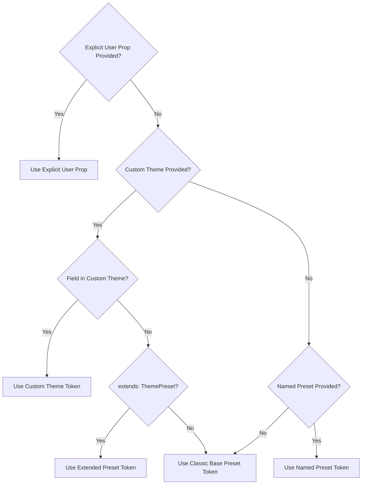

# Implementation Specification: Predefined Visual Themes

**Feature Issue:** [#6 - [Feature] Predefined Visual Themes for Lanterns and Overlays](https://github.com/3mr-5aled/ramadan-overlay/issues/6)  
**Parent Wayfinder Map:** [#29 - Wayfinder Map: Predefined Visual Themes for Lanterns and Overlays](https://github.com/3mr-5aled/ramadan-overlay/issues/29)  
**Status:** Ready for Implementation (`ready-for-agent` / `ready-for-human`)

---

## 1. Executive Summary

This specification establishes the architecture, schema, preset registry, token mappings, and runtime switching semantics for **Predefined Visual Themes** in `ramadan-overlay`.

Rather than requiring developers to manually source hex codes for individual lanterns, ropes, glowing drop-shadows, banner bars, and countdown cards, this feature introduces **5 curated cultural theme presets** (`classic`, `midnight`, `emerald`, `royal`, and `desert-dusk`) along with first-class support for custom theme objects.

Themes operate globally across the entire library, harmonizing all six visual decoration variants (`lanterns`, `geometric`, `sparkles`, `crescent-stars`, `eid`, `banner`) and the floating `countdown` widget. Themes switch instantaneously at runtime with zero DOM reflow or element reinstantiation, maintain full WCAG 2.1 AAA contrast compliance, preserve 100% backward compatibility, and integrate smoothly into React, Vue, Svelte, and Angular wrappers.

---

## 2. Settled Decisions Index

| Decision Ticket                                               | Title                                                              | Core Resolution                                                                                                                                                                                                                                                                                                  |
| ------------------------------------------------------------- | ------------------------------------------------------------------ | ---------------------------------------------------------------------------------------------------------------------------------------------------------------------------------------------------------------------------------------------------------------------------------------------------------------- |
| [#30](https://github.com/3mr-5aled/ramadan-overlay/issues/30) | Research: Curated cultural and festive color harmonies             | Curated 5 culturally grounded presets (`classic`, `midnight`, `emerald`, `royal`, `desert-dusk`) with 6-slot color arrays, structural tokens, and countdown tokens. Mathematically verified WCAG 2.1 AA/AAA contrast ratios (11.7:1 to 17.2:1) across both light and dark host application surfaces.             |
| [#31](https://github.com/3mr-5aled/ramadan-overlay/issues/31) | Prototype: Theme definition schema, registry & override resolution | Validated `ThemeDefinition` and `ThemePreset` types in an interactive prototype (`docs/prototypes/prototype-theme-resolution.html`). Established deterministic override precedence: **User Props > Custom Theme > Preset > Classic**. Verified sub-millisecond dynamic switching via root CSS custom properties. |
| [#32](https://github.com/3mr-5aled/ramadan-overlay/issues/32) | Grilling: Finalize theme API surface & switching semantics         | Finalized package exports (`THEME_PRESETS`, `themes` dictionary, types), dedicated `overlay.setTheme(theme)` instance method, banner variant CSS variable refactoring (`--ro-banner-*`), `extends?: ThemePreset` for custom themes, and reactive prop bindings across all framework adapters.                    |

---

## 3. Domain Concepts & Architectural Invariants

### 3.1. Unified Theme Token Model

A visual theme is a holistic design token bundle containing:

1. **Palette Slots (`colors[0..5]`):** Six ordered hex codes that provide rhythm, high/mid/dark contrast, and highlight accents.
2. **Atmospheric Tokens (`glowColor`, `ceilingColor`, `ropeColor`):** CSS colors driving candlelight drop-shadows, ceiling mounting lines, and hanging ropes.
3. **Banner Tokens (`bannerBg`, `bannerTextColor`, `bannerIconColor`):** Styling for full-width pushdown announcement bars.
4. **Countdown Tokens (`countdownBg`, `countdownBorder`, `countdownAccent`):** Surface, border, and tabular number colors for the Iftar countdown card.

### 3.2. Override Precedence Hierarchy

Every design token resolves with deterministic priority:

$$\text{Final Token} = \text{User Explicit Prop} \succ \text{Custom Theme Prop} \succ \text{Preset Theme Prop} \succ \text{Classic Base Default}$$



### 3.3. Zero-Flicker Dynamic Updating

Theme changes must **never tear down or rebuild DOM elements**.

- All variants (lantern rows, vertical side bands, banner bars, particles, and countdown cards) bind to CSS custom properties (`--ro-*`).
- Calling `overlay.setTheme(newTheme)` or `overlay.update({ theme: newTheme })` immediately recalculates tokens and sets CSS variables via `applyTokens(root, newConfig)` on the host container.
- Execution latency is under 1 millisecond with zero repaint of underlying DOM trees.

---

## 4. Public API Contracts (`src/types.ts`)

### 4.1. Theme Types & Interfaces

```typescript
/**
 * Built-in cultural theme presets.
 */
export type ThemePreset =
  "classic" | "midnight" | "emerald" | "royal" | "desert-dusk";

/**
 * Complete visual theme definition schema.
 */
export interface ThemeDefinition {
  /** Optional human-readable theme name */
  name?: string;

  /** Optional preset name to inherit unprovided tokens from (defaults to 'classic') */
  extends?: ThemePreset;

  /** Primary 6-slot color palette for multi-variant rendering */
  colors: [string, string, string, string, string, string] | string[];

  /** Drop-shadow halo and ambient particle glow (rgba) */
  glowColor: string;

  /** Ceiling mounting line and vertical spine cord color */
  ceilingColor: string;

  /** Individual lantern dropline cord color */
  ropeColor: string;

  /** Banner bar background color (rgba) */
  bannerBg: string;

  /** Banner greeting text typography color */
  bannerTextColor: string;

  /** Banner icon accent color */
  bannerIconColor: string;

  /** Countdown widget card background */
  countdownBg?: string;

  /** Countdown widget border outline */
  countdownBorder?: string;

  /** Countdown widget tabular digits & milestone celebration flare */
  countdownAccent?: string;
}

/**
 * Theme configuration option: either a preset name or a partial/complete custom theme.
 */
export type ThemeOption = ThemePreset | Partial<ThemeDefinition>;
```

### 4.2. Configuration Interface Extension (`RamadanOverlayConfig`)

```typescript
export interface RamadanOverlayConfig {
  /**
   * Predefined visual theme preset or custom theme object.
   * Harmonizes colors, glow, ceiling, rope, banner, and countdown tokens across all variants.
   * @default 'classic'
   */
  theme?: ThemeOption;

  // Existing properties remain fully backward-compatible as explicit overrides:
  colors?: string[];
  glowColor?: string;
  ceilingColor?: string;
  ropeColor?: string;
  bannerBg?: string;
  bannerTextColor?: string;
  bannerIconColor?: string;
  // ...
}
```

### 4.3. Overlay Instance Extension (`RamadanOverlayInstance`)

```typescript
export interface RamadanOverlayInstance {
  /** Reconfigures the overlay with partial options at runtime. */
  update: (config: Partial<RamadanOverlayConfig>) => void;

  /**
   * Ergonomic shortcut to dynamically switch the active theme.
   * Equivalent to `update({ theme })`.
   */
  setTheme: (theme: ThemeOption) => void;

  /** Removes all overlay elements and detaches listeners. */
  destroy: () => void;

  /** Returns current active state. */
  getState: () => RamadanState;
}
```

---

## 5. Curated Presets Registry (`src/core/themes.ts`)

The library exports `THEME_PRESETS` and the `themes` dictionary:

```typescript
export const THEME_PRESETS: Record<ThemePreset, ThemeDefinition> = {
  classic: {
    name: "classic",
    colors: ["#c9a84c", "#e5c158", "#8b4513", "#2d5a27", "#fff7cc", "#1a3a1a"],
    glowColor: "rgba(201, 168, 76, 0.55)",
    ceilingColor: "#8b4513",
    ropeColor: "#c9a84c",
    bannerBg: "rgba(24, 19, 8, 0.95)",
    bannerTextColor: "#fae17d",
    bannerIconColor: "#e5c158",
    countdownBg: "rgba(26, 20, 10, 0.95)",
    countdownBorder: "rgba(201, 168, 76, 0.35)",
    countdownAccent: "#e5c158",
  },
  midnight: {
    name: "midnight",
    colors: ["#fbbf24", "#e2e8f0", "#38bdf8", "#6366f1", "#f8fafc", "#1e293b"],
    glowColor: "rgba(56, 189, 248, 0.55)",
    ceilingColor: "#1e293b",
    ropeColor: "#64748b",
    bannerBg: "rgba(15, 23, 42, 0.95)",
    bannerTextColor: "#f8fafc",
    bannerIconColor: "#fbbf24",
    countdownBg: "rgba(15, 23, 42, 0.95)",
    countdownBorder: "rgba(56, 189, 248, 0.35)",
    countdownAccent: "#fbbf24",
  },
  emerald: {
    name: "emerald",
    colors: ["#f59e0b", "#10b981", "#059669", "#064e3b", "#fde68a", "#022c22"],
    glowColor: "rgba(16, 185, 129, 0.55)",
    ceilingColor: "#064e3b",
    ropeColor: "#059669",
    bannerBg: "rgba(2, 44, 34, 0.95)",
    bannerTextColor: "#fef3c7",
    bannerIconColor: "#f59e0b",
    countdownBg: "rgba(4, 38, 28, 0.95)",
    countdownBorder: "rgba(16, 185, 129, 0.35)",
    countdownAccent: "#f59e0b",
  },
  royal: {
    name: "royal",
    colors: ["#fcd34d", "#a78bfa", "#7c3aed", "#4c1d95", "#fef08a", "#2e1065"],
    glowColor: "rgba(167, 139, 250, 0.55)",
    ceilingColor: "#4c1d95",
    ropeColor: "#8b5cf6",
    bannerBg: "rgba(30, 11, 64, 0.95)",
    bannerTextColor: "#fef08a",
    bannerIconColor: "#fcd34d",
    countdownBg: "rgba(32, 13, 64, 0.95)",
    countdownBorder: "rgba(167, 139, 250, 0.35)",
    countdownAccent: "#fcd34d",
  },
  "desert-dusk": {
    name: "desert-dusk",
    colors: ["#f97316", "#fde047", "#ea580c", "#c2410c", "#fed7aa", "#7c2d12"],
    glowColor: "rgba(249, 115, 22, 0.55)",
    ceilingColor: "#7c2d12",
    ropeColor: "#c2410c",
    bannerBg: "rgba(43, 14, 5, 0.95)",
    bannerTextColor: "#fef3c7",
    bannerIconColor: "#f97316",
    countdownBg: "rgba(43, 14, 5, 0.95)",
    countdownBorder: "rgba(249, 115, 22, 0.35)",
    countdownAccent: "#fde047",
  },
};

/**
 * Convenience namespace object for theme presets.
 */
export const themes = {
  classic: THEME_PRESETS.classic,
  midnight: THEME_PRESETS.midnight,
  emerald: THEME_PRESETS.emerald,
  royal: THEME_PRESETS.royal,
  desertDusk: THEME_PRESETS["desert-dusk"],
};
```

---

## 6. Resolution & Cascading Algorithm

### 6.1. Token Resolution Implementation

```typescript
export function resolveTheme(
  themeOption?: ThemeOption,
  explicitConfig?: Partial<RamadanOverlayConfig>
): ThemeDefinition {
  // 1. Identify base preset
  let basePresetName: ThemePreset = "classic";
  let customOverrides: Partial<ThemeDefinition> = {};

  if (typeof themeOption === "string") {
    if (THEME_PRESETS[themeOption]) {
      basePresetName = themeOption;
    }
  } else if (typeof themeOption === "object" && themeOption !== null) {
    if (themeOption.extends && THEME_PRESETS[themeOption.extends]) {
      basePresetName = themeOption.extends;
    }
    customOverrides = themeOption;
  }

  const baseTheme = THEME_PRESETS[basePresetName];

  // 2. Resolve colors array
  let colors: string[] = [...baseTheme.colors];
  if (explicitConfig?.colors && explicitConfig.colors.length > 0) {
    colors = explicitConfig.colors;
  } else if (customOverrides.colors && customOverrides.colors.length > 0) {
    colors = customOverrides.colors;
  }

  // 3. Resolve scalar tokens with strict precedence: Explicit Prop > Custom Theme > Base Preset
  return {
    name:
      typeof themeOption === "string"
        ? themeOption
        : (customOverrides.name ?? "custom"),
    extends: basePresetName,
    colors,
    glowColor:
      explicitConfig?.glowColor ??
      customOverrides.glowColor ??
      baseTheme.glowColor,
    ceilingColor:
      explicitConfig?.ceilingColor ??
      customOverrides.ceilingColor ??
      baseTheme.ceilingColor,
    ropeColor:
      explicitConfig?.ropeColor ??
      customOverrides.ropeColor ??
      baseTheme.ropeColor,
    bannerBg:
      explicitConfig?.bannerBg ??
      customOverrides.bannerBg ??
      baseTheme.bannerBg,
    bannerTextColor:
      explicitConfig?.bannerTextColor ??
      customOverrides.bannerTextColor ??
      baseTheme.bannerTextColor,
    bannerIconColor:
      explicitConfig?.bannerIconColor ??
      customOverrides.bannerIconColor ??
      baseTheme.bannerIconColor,
    countdownBg: customOverrides.countdownBg ?? baseTheme.countdownBg,
    countdownBorder:
      customOverrides.countdownBorder ?? baseTheme.countdownBorder,
    countdownAccent:
      customOverrides.countdownAccent ?? baseTheme.countdownAccent,
  };
}
```

### 6.2. CSS Custom Properties Synchronization (`src/core/host.ts`)

In `applyTokens(root: HTMLElement, config: ResolvedConfig)`:

```typescript
export function applyTokens(root: HTMLElement, config: ResolvedConfig): void {
  const el = root.style;
  el.setProperty("--ro-opacity", String(config.opacity));
  el.setProperty("--ro-z", String(config.zIndex));
  el.setProperty("--ro-glow", config.glowColor);
  el.setProperty("--ro-ceiling", config.ceilingColor);
  el.setProperty("--ro-rope", config.ropeColor);
  el.setProperty("--ro-banner-bg", config.bannerBg);
  el.setProperty("--ro-banner-text", config.bannerTextColor);
  el.setProperty("--ro-banner-icon", config.bannerIconColor);

  // Sync countdown widget tokens if present
  if (config.countdownBg)
    el.setProperty("--ro-countdown-bg", config.countdownBg);
  if (config.countdownBorder)
    el.setProperty("--ro-countdown-border", config.countdownBorder);
  if (config.countdownAccent)
    el.setProperty("--ro-countdown-gold", config.countdownAccent);

  config.colors.forEach((c, i) => {
    el.setProperty(`--ro-color-${i + 1}`, c);
  });

  root.setAttribute("data-theme", config.themeName ?? "classic");
  root.setAttribute("data-mobile-side", config.mobileSideBehavior);
  root.setAttribute("data-position", config.position);
  if (resolveSidePositions(config.position).length > 0) {
    root.setAttribute("data-is-side", "true");
  } else {
    root.removeAttribute("data-is-side");
  }
}
```

### 6.3. Banner Variant Refactoring (`src/core/variants/banner.ts`)

The banner variant elements must bind directly to CSS variables for live reactivity:

- Background: `var(--ro-banner-bg, ${bg})`
- Typography text: `var(--ro-banner-text, ${textColor})`
- SVG icon fill: `var(--ro-banner-icon, ${iconColor})`

---

## 7. Framework Wrapper Integration

### 7.1. React (`src/react/RamadanOverlay.tsx`)

```tsx
export interface RamadanOverlayProps extends RamadanOverlayConfig {
  theme?: ThemeOption;
}

export const RamadanOverlay: React.FC<RamadanOverlayProps> = ({
  theme,
  ...restProps
}) => {
  const overlayRef = useRef<RamadanOverlayInstance | null>(null);

  useEffect(() => {
    overlayRef.current = init({ theme, ...restProps });
    return () => overlayRef.current?.destroy();
  }, []);

  useEffect(() => {
    if (overlayRef.current && theme !== undefined) {
      overlayRef.current.setTheme(theme);
    }
  }, [theme]);

  return null;
};
```

### 7.2. Vue 3 (`src/vue/RamadanOverlay.vue`)

```vue
<script setup lang="ts">
import { onMounted, onUnmounted, watch } from "vue";
import { init, type RamadanOverlayConfig, type ThemeOption } from "../index";

const props = defineProps<RamadanOverlayConfig>();
let overlay: ReturnType<typeof init> | null = null;

onMounted(() => {
  overlay = init(props);
});

watch(
  () => props.theme,
  (newTheme) => {
    if (overlay && newTheme !== undefined) {
      overlay.setTheme(newTheme);
    }
  }
);

onUnmounted(() => {
  overlay?.destroy();
});
</script>
```

### 7.3. Svelte (`src/svelte/RamadanOverlay.svelte`) & Angular (`src/angular/`)

Follow identical patterns:

- Props include `theme?: ThemeOption`.
- Reactive change triggers `overlay.setTheme(newTheme)` without teardown.

---

## 8. Migration & Backward Compatibility

1. **Zero Breaking Changes:** Calling `init()` with no configuration or existing options (`colors`, `glowColor`, `ceilingColor`, etc.) works identically to existing releases.
2. **Explicit Props Retain Precedence:** Any application passing `colors: ['#ff0000']` will continue to see their custom color override regardless of active theme.
3. **No External CSS:** All theme variables and keyframes remain dynamically injected into `<head>` via `host.ts` maintaining the zero-dependency promise.

---

## 9. Verification & Test Suite Requirements

The implementation PR must include comprehensive tests in `src/core/themes.test.ts`, `src/core/injector.test.ts`, and `src/core/host.test.ts`:

1. **Preset Resolution Tests:**
   - Verify all 5 presets (`classic`, `midnight`, `emerald`, `royal`, `desert-dusk`) resolve to the ratified 6-color arrays and tokens.
   - Verify fallback to `classic` when an invalid theme string is provided.
2. **Precedence Hierarchy Tests:**
   - Verify top-level `config.colors` overrides `theme.colors`.
   - Verify top-level `config.glowColor` overrides `theme.glowColor`.
   - Verify partial custom theme inheriting via `extends: 'midnight'` retains midnight's ceiling/rope tokens while adopting custom colors.
3. **Dynamic Updating Tests:**
   - Verify `overlay.setTheme('royal')` updates root CSS properties (`--ro-color-*`, `--ro-glow`, `--ro-ceiling`) without altering the container's child DOM tree.
   - Verify `overlay.update({ theme: 'emerald' })` performs the same update.
4. **Framework Wrapper Tests:**
   - Verify React / Vue components reactively trigger `setTheme` upon prop change.
