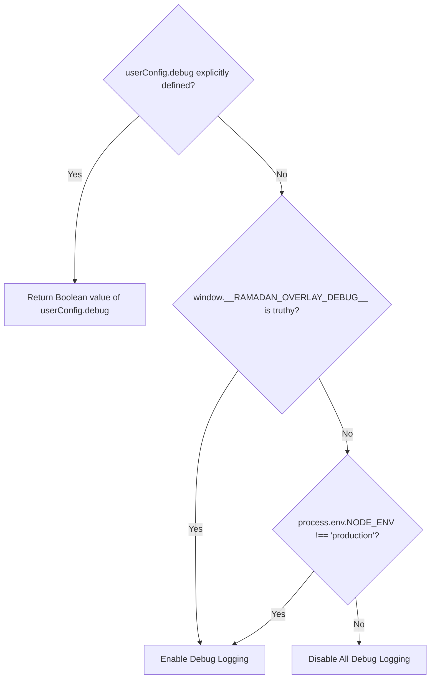

# Implementation Specification: Robust Error Handling and Initialization Safety

**Feature Issue:** [#4 - [Improvement] Robust Error Handling and Initialization Safety](https://github.com/3mr-5aled/ramadan-overlay/issues/4)  
**Parent Wayfinder Map:** [#39 - Wayfinder Map: Robust Error Handling and Initialization Safety (#4)](https://github.com/3mr-5aled/ramadan-overlay/issues/39)  
**Status:** Ready for Implementation (`ready-for-agent` / `ready-for-human`)

---

## 1. Executive Summary

This specification establishes the architectural patterns, validation algorithms, error containment boundaries, and developer diagnostic logging rules for **Robust Error Handling and Initialization Safety** in `ramadan-overlay`.

Prior to this specification, `ramadan-overlay` provided basic SSR guards (`typeof document === "undefined"`), but remained vulnerable to:

1. **Host Application Crashes:** Uncaught exceptions thrown during DOM host mounting, CSS stylesheet injection, or SVG generation bubbled up, potentially halting host rendering in frameworks like React, Vue, Angular, or Svelte.
2. **The ECMA-402 Silent Gregorian Fallback Trap:** In runtime environments lacking Islamic ICU datasets (e.g. small-ICU Node.js builds, Alpine Linux Docker containers, restricted WebViews), `Intl.DateTimeFormat` silently defaults to the Gregorian calendar (`'gregory'`), triggering false positive Ramadan decorations in Gregorian September.
3. **Adversarial Date Inputs:** Malformed queries (`null`, `undefined`, `new Date(NaN)`) threw unhandled `TypeError` or `RangeError: Invalid time value`.
4. **Invalid User Configurations:** Out-of-bounds numbers (`opacity: -5`, `opacity: 99`) and malformed string unions caused invalid CSS declarations or rendering bugs instead of defensive clamping.
5. **Silent Dormant State DX Friction:** When `autoTrigger: true` runs outside Ramadan or Eid, the overlay remains dormant without any console feedback, confusing developers into thinking the library failed to load.

This specification introduces a zero-crash defensive architecture guaranteeing:

- **Zero Host Crashes:** The library will never throw an unhandled exception to the caller.
- **Infallible Safe No-Op Instance:** Mid-init failure returns a safe no-op instance that satisfies the complete `OverlayInstance` contract.
- **Atomic DOM Rollback:** Partial DOM nodes or `<style>` tags are immediately purged if initialization fails mid-flight.
- **Double-Contained Telemetry:** An optional `onError?: (error: unknown) => void` hook enables error reporting (e.g., Sentry, Datadog) while preventing buggy telemetry handlers from crashing the host app.
- **100% Production Console Silence:** Diagnostic logs appear only during local development or when `debug: true` is explicitly passed.

---

## 2. Settled Decisions Index

| Decision Ticket                                               | Title                                                              | Core Resolution                                                                                                                                                                                                                                 |
| :------------------------------------------------------------ | :----------------------------------------------------------------- | :---------------------------------------------------------------------------------------------------------------------------------------------------------------------------------------------------------------------------------------------- |
| [#40](https://github.com/3mr-5aled/ramadan-overlay/issues/40) | Research: Intl edge cases, SSR resilience, and error telemetry     | Discovered ECMA-402 silent Gregorian fallback trap; resolved via `calendar.startsWith('islamic')` check. Formulated `coerceToValidDate()` normalizer, inert no-op contract, atomic DOM teardown, and double-contained telemetry seam.           |
| [#41](https://github.com/3mr-5aled/ramadan-overlay/issues/41) | Prototype: Defensive config clamping matrix & debug logger         | Validated defensive numeric clamping (`opacity` $[0, 1]$, `zIndex`, `ropeSag` $[6, 60]$), string union sanitization with fallback defaults, atomic DOM cleanup, and diagnostic logging in interactive demo (`prototype/error-handling-safety`). |
| [#42](https://github.com/3mr-5aled/ramadan-overlay/issues/42) | Grilling: Error containment contracts, no-op instance, and onError | Ratified inert no-op instance contract (subsequent calls safe no-ops, immutable dormant state). Ratified `onError?: (error: unknown) => void` with double-containment. Ratified atomic cleanup scope and debug activation hierarchy.            |

---

## 3. Defensive Configuration Clamping & Sanitization Matrix

All user-supplied configuration properties passed into `init(userConfig)` or `overlay.update(newConfig)` must be sanitized in `resolveConfig()` via defensive helper functions.

### 3.1. Numeric Clamping Helpers

```typescript
/**
 * Safely clamp a numeric configuration value.
 * Falls back if the value is not a finite number or is NaN.
 */
export function clampNumber(
  val: unknown,
  min: number,
  max: number,
  fallback: number
): number {
  if (typeof val !== "number" || isNaN(val) || !isFinite(val)) {
    return fallback;
  }
  return Math.max(min, Math.min(max, val));
}
```

#### Numeric Field Matrix

| Property          | Valid Range                 | Fallback Default | Clamping Behavior                                                                                    |
| :---------------- | :-------------------------- | :--------------- | :--------------------------------------------------------------------------------------------------- |
| `opacity`         | $[0.0, 1.0]$                | `0.85`           | Negative values clamp to `0.0`; values $> 1.0$ clamp to `1.0`. `NaN`, non-numbers default to `0.85`. |
| `zIndex`          | $[-2147483648, 2147483647]$ | `9999`           | Non-finite numbers, strings, or `NaN` default to `9999`. Integer clamped within safe 32-bit range.   |
| `ropeSag`         | $[6, 60]$                   | `20`             | Clamped to minimum `6` and maximum `60`. Non-numbers default to `20`.                                |
| `hijriAdjustment` | $[-3, 3]$                   | `0` (or region)  | If defined, clamped to integer in $[-3, 3]$. Non-finite numbers default to `0`.                      |

### 3.2. String Literal Union Sanitization

```typescript
/**
 * Sanitize string union literal properties.
 * If unrecognized or malformed, emits a debug warning and returns fallback.
 */
export function sanitizeStringUnion<T extends string>(
  val: unknown,
  validList: readonly T[],
  fallback: T,
  propertyName: string,
  debug: boolean
): T {
  if (
    typeof val === "string" &&
    (validList as readonly string[]).includes(val)
  ) {
    return val as T;
  }
  if (val !== undefined && debug) {
    console.warn(
      `[ramadan-overlay] Invalid ${propertyName} "${String(val)}"; falling back to "${fallback}".`
    );
  }
  return fallback;
}
```

#### String Union Field Matrix

| Property             | Valid Values                                                                       | Fallback Default                                   |
| :------------------- | :--------------------------------------------------------------------------------- | :------------------------------------------------- |
| `variant`            | `'lanterns'`, `'sparkles'`, `'crescent-stars'`, `'geometric'`, `'banner'`, `'eid'` | `'lanterns'`                                       |
| `position`           | `'top'`, `'bottom'`, `'left'`, `'right'`, `'sides'`, `'both'`, `'start'`, `'end'`  | `'both'` (`'top'` for banner)                      |
| `density`            | `'low'`, `'normal'`, `'high'`                                                      | `'normal'` (or `'low'` on mobile $< 640\text{px}$) |
| `ropeStyle`          | `'straight'`, `'u-shaped'`, `'dual'`                                               | `'straight'`                                       |
| `theme`              | `'classic'`, `'midnight'`, `'emerald'`, `'royal'`, `'desert-dusk'`, or object      | `'classic'`                                        |
| `mobileSideBehavior` | `'hide'`, `'top'`, `'visible'`                                                     | `'hide'`                                           |
| `locale`             | `'en'`, `'ar'`                                                                     | `'en'`                                             |
| `confetti`           | `'on'`, `'off'`, `'once'`                                                          | `'on'`                                             |

### 3.3. Array Field Sanitization (`occasions`)

If `userConfig.occasions` is provided:

1. If not an `Array`, default to `['ramadan', 'eid-fitr', 'eid-adha']`.
2. Filter elements against valid `Occasion` literals (`['ramadan', 'eid-fitr', 'eid-adha']`).
3. If filtered array is empty, fallback to `['ramadan', 'eid-fitr', 'eid-adha']`.

---

## 4. Environment Hardening & Date Resilience (`src/core/detector.ts`)

### 4.1. Date Input Normalization: `coerceToValidDate()`

`getRamadanState()` accepts either `Date | OccasionDateQuery | RamadanDateQuery`. To prevent `TypeError` or `RangeError`, inputs are coerced defensively:

```typescript
/**
 * Normalizes input date/query into a guaranteed valid Date instance.
 * Recovers from null, undefined, new Date(NaN), ISO strings, or malformed queries.
 */
export function coerceToValidDate(
  queryOrDate?: unknown,
  debug = false
): { targetDate: Date; effectiveOffset: number } {
  let rawDate: unknown;
  let offset = 0;

  if (queryOrDate instanceof Date) {
    rawDate = queryOrDate;
  } else if (typeof queryOrDate === "object" && queryOrDate !== null) {
    const query = queryOrDate as Record<string, unknown>;
    rawDate = query.date;
    offset = resolveHijriOffset(
      query.region as HijriRegion,
      query.hijriAdjustment as number
    );
  }

  let targetDate: Date;
  if (rawDate instanceof Date && !isNaN(rawDate.getTime())) {
    targetDate = rawDate;
  } else if (typeof rawDate === "string" || typeof rawDate === "number") {
    const parsed = new Date(rawDate);
    targetDate = !isNaN(parsed.getTime()) ? parsed : new Date();
  } else {
    if (rawDate !== undefined && debug) {
      console.warn(
        `[ramadan-overlay] Invalid Date "${String(rawDate)}"; falling back to current date.`
      );
    }
    targetDate = new Date();
  }

  // Ensure effectiveOffset is finite
  const sanitizedOffset = isFinite(offset)
    ? Math.max(-3, Math.min(3, Math.round(offset)))
    : 0;

  return { targetDate, effectiveOffset: sanitizedOffset };
}
```

### 4.2. Intercepting the ECMA-402 Silent Gregorian Fallback Trap

In environments lacking the `islamic-umalqura` ICU dataset:

```typescript
function getHijriParts(
  date: Date
): { month: number; day: number; year: number } | null {
  try {
    if (
      typeof Intl === "undefined" ||
      typeof Intl.DateTimeFormat !== "function"
    ) {
      return null;
    }

    const formatter = new Intl.DateTimeFormat("en-u-ca-islamic-umalqura", {
      day: "numeric",
      month: "numeric",
      year: "numeric",
    });

    // Guard against environments where formatToParts is missing
    if (typeof formatter.formatToParts !== "function") {
      return null;
    }

    // CRITICAL: Verify that the runtime actually resolved an Islamic calendar!
    const resolvedCalendar = formatter.resolvedOptions().calendar;
    if (!resolvedCalendar || !resolvedCalendar.startsWith("islamic")) {
      // Runtime silently fell back to 'gregory' (small-ICU Node.js, Alpine Linux)
      // We must return null so detection cleanly falls back to the precomputed table!
      return null;
    }

    const parts = formatter.formatToParts(date);
    if (!Array.isArray(parts) || parts.length === 0) {
      return null;
    }

    const get = (type: string) => {
      const part = parts.find((p) => p.type === type);
      return part ? parseInt(part.value, 10) : NaN;
    };

    const month = get("month");
    const day = get("day");
    const year = get("year");

    if (isNaN(month) || isNaN(day) || isNaN(year)) return null;
    return { month, day, year };
  } catch {
    return null;
  }
}
```

### 4.3. Immutable Inert State Definition

When date detection fails entirely or SSR runs:

```typescript
export const INERT_RAMADAN_STATE: Readonly<RamadanState> = Object.freeze({
  isRamadan: false,
  occasion: "none",
  isEid: false,
  hijriYear: 0,
  hijriMonth: 0,
  hijriDay: 0,
  dayNumber: 0,
});
```

---

## 5. Catastrophic Error Containment & No-Op Contract (`src/core/injector.ts`)

### 5.1. The `init()` Containment Boundary

`init()` wraps configuration resolution, date detection, DOM host mounting, variant rendering, and audio scheduling in a comprehensive `try...catch` boundary:

```typescript
export function init(userConfig: RamadanOverlayConfig = {}): OverlayInstance {
  // 1. SSR Guard
  if (typeof document === "undefined") {
    return createSafeNoopInstance(
      resolveConfig(userConfig),
      INERT_RAMADAN_STATE
    );
  }

  let currentConfig: ResolvedConfig;
  try {
    currentConfig = resolveConfig(userConfig);
  } catch (configError) {
    // If resolveConfig throws an unexpected error, safely fallback
    currentConfig = resolveConfig({});
  }

  const debug = isDebugActive(currentConfig);

  try {
    // Standard initialization: state calculation, host mounting, variant rendering...
    // ...
  } catch (catastrophicError) {
    // 1. Atomic DOM Rollback
    performAtomicDomRollback();

    // 2. Double-contained Telemetry Hook
    safeInvokeTelemetry(userConfig.onError, catastrophicError, debug);

    // 3. Developer Diagnostic Error Logging
    if (debug) {
      console.error(
        "[ramadan-overlay] Catastrophic initialization error caught by containment boundary:",
        catastrophicError
      );
    }

    // 4. Return infallible safe no-op instance
    return createSafeNoopInstance(currentConfig, INERT_RAMADAN_STATE);
  }
}
```

### 5.2. Atomic DOM Rollback

If initialization fails mid-execution, any partially appended DOM nodes or stylesheet elements are cleaned up:

```typescript
export function performAtomicDomRollback(): void {
  try {
    if (typeof document === "undefined") return;
    document.getElementById("ramadan-overlay-root")?.remove();
    document.getElementById("ramadan-overlay-styles")?.remove();
    document.getElementById("ramadan-countdown-root")?.remove();
    document.getElementById("ramadan-countdown-styles")?.remove();
  } catch {
    // Suppress errors in highly restrictive DOM environments
  }
}
```

### 5.3. Double-Contained Telemetry Hook

```typescript
export function safeInvokeTelemetry(
  handler: ((error: unknown) => void) | undefined,
  error: unknown,
  debug: boolean
): void {
  if (typeof handler !== "function") return;
  try {
    handler(error);
  } catch (telemetryError) {
    // Isolated catch block: prevents faulty user telemetry handlers from crashing the app
    if (debug) {
      console.warn(
        "[ramadan-overlay] Exception thrown inside consumer onError callback:",
        telemetryError
      );
    }
  }
}
```

### 5.4. Infallible Safe No-Op `OverlayInstance`

```typescript
export function createSafeNoopInstance(
  config: ResolvedConfig,
  state: RamadanState = INERT_RAMADAN_STATE
): OverlayInstance {
  return {
    destroy: () => undefined,
    update: () => undefined,
    setTheme: () => undefined,
    container: null,
    config,
    state,
    getState: () => ({ ...state }),
    getCountdownController: () => null,
  };
}
```

---

## 6. Developer Diagnostic Logging Architecture

### 6.1. Activation Hierarchy



```typescript
export function isDebugActive(config?: { debug?: boolean }): boolean {
  // 1. Explicit user config takes absolute precedence
  if (config && typeof config.debug === "boolean") {
    return config.debug;
  }

  // 2. Global runtime override via browser console
  if (
    typeof window !== "undefined" &&
    Boolean((window as Record<string, unknown>).__RAMADAN_OVERLAY_DEBUG__) ===
      true
  ) {
    return true;
  }

  // 3. Development environment heuristic
  try {
    if (
      typeof process !== "undefined" &&
      process?.env?.NODE_ENV &&
      process.env.NODE_ENV !== "production"
    ) {
      return true;
    }
  } catch {
    // Suppress ReferenceError in environments where process is restricted
  }

  return false;
}
```

### 6.2. Dormant State Diagnostic Notice

When `autoTrigger: true` is active (and not `previewMode`), but `state.occasion === 'none'`:

```typescript
if (
  debug &&
  currentConfig.autoTrigger &&
  !currentConfig.previewMode &&
  currentState.occasion === "none"
) {
  console.info(
    `[ramadan-overlay] Overlay dormant: autoTrigger is enabled, but current date (${new Date().toISOString().slice(0, 10)}) does not fall within configured occasions (${currentConfig.occasions.join(", ")}). Pass previewMode: true to force display during development.`
  );
}
```

When `previewMode: true` is enabled:

```typescript
if (debug && currentConfig.previewMode) {
  console.info(
    "[ramadan-overlay] Preview mode active: overlay forced visible regardless of Hijri calendar date."
  );
}
```

---

## 7. Public TypeScript Interfaces (`src/types.ts`)

Update `RamadanOverlayConfig` and `OverlayConfig`:

```typescript
export interface RamadanOverlayConfig {
  // ... existing fields ...

  /**
   * Enable diagnostic developer console logging.
   * When true, emits guidance when autoTrigger is dormant and warnings on clamped config values.
   * Defaults to active in non-production environments (`NODE_ENV !== 'production'`).
   */
  debug?: boolean;

  /**
   * Optional telemetry error handler invoked if overlay initialization or dynamic update fails.
   * Enclosed in double-containment so errors within the handler never crash the host application.
   */
  onError?: (error: unknown) => void;
}
```

Update `OverlayInstance`:

```typescript
export interface OverlayInstance {
  /** Destroy the overlay and remove all DOM elements and styles */
  destroy(): void;
  /** Update overlay configuration dynamically */
  update(newConfig: Partial<RamadanOverlayConfig>): void;
  /** Dynamically switch the visual theme */
  setTheme(theme: ThemeOption): void;
  /** Root container element (null if destroyed or failed to initialize) */
  container: HTMLElement | null;
  /** Current resolved configuration */
  readonly config: ResolvedConfig;
  /** Current detected Ramadan/occasion state */
  readonly state: RamadanState;
  /** Returns a snapshot copy of current Ramadan state */
  getState(): RamadanState;
  /** Access the active countdown controller (if countdown is enabled) */
  getCountdownController(): IftarCountdownController | null;
}
```

---

## 8. Framework Wrappers Alignment

Each framework adapter component/composable will forward `debug` and `onError`:

1. **React (`src/react/`):**
   - Forward `debug?: boolean` and `onError?: (error: unknown) => void` in `RamadanOverlayProps` and `useRamadanOverlay()`.
2. **Vue 3 (`src/vue/`):**
   - Forward `debug` and `onError` in `RamadanOverlay.vue` props and `useRamadanOverlay()` composable.
3. **Svelte (`src/svelte/`):**
   - Forward `debug` and `onError` props in `RamadanOverlay.svelte`.
4. **Angular (`src/angular/`):**
   - Add `@Input() debug?: boolean;` and `@Input() onError?: (error: unknown) => void;` to `RamadanOverlayComponent`.

---

## 9. Verification & Test Plan

A comprehensive test suite will be created/extended in `vitest`:

### 9.1. Unit Tests: `src/core/detector.test.ts`

- **ECMA-402 Silent Fallback Interception:** Mock `Intl.DateTimeFormat` with `calendar: 'gregory'`; assert `getRamadanState()` falls back to precomputed table without falsely reporting Ramadan in September.
- **Missing `formatToParts`:** Mock `Intl.DateTimeFormat` with `formatToParts: undefined`; assert clean table fallback.
- **Date Normalization:** Call `getRamadanState(new Date(NaN))`, `getRamadanState(null as any)`, `getRamadanState({ date: "2026-03-01" } as any)`; assert valid `RamadanState` returned without throwing.

### 9.2. Unit Tests: `src/core/injector.test.ts`

- **Catastrophic Failure Boundary:** Mock `mountHost` to throw an error; assert `init()` does not throw, returns an instance with `container: null`, and all methods (`destroy`, `update`, `setTheme`, `getState`) execute cleanly.
- **Atomic DOM Rollback:** Verify partial container `<div>` and `<style>` elements are removed on error.
- **Telemetry Hook:** Verify consumer `onError` is called with the thrown error.
- **Telemetry Double-Containment:** Pass an `onError` that itself throws `new Error("Telemetry crash")`; assert `init()` does not throw.
- **Defensive Clamping:** Call `init({ opacity: -5, zIndex: "invalid" as any, ropeSag: 1000 })`; verify `instance.config.opacity === 0`, `instance.config.zIndex === 9999`, and `instance.config.ropeSag === 60`.
- **Diagnostic Logging:** Spy on `console.info` / `console.warn`; verify dormant autoTrigger message is logged when `debug: true` outside Ramadan, and suppressed when `debug: false`.
